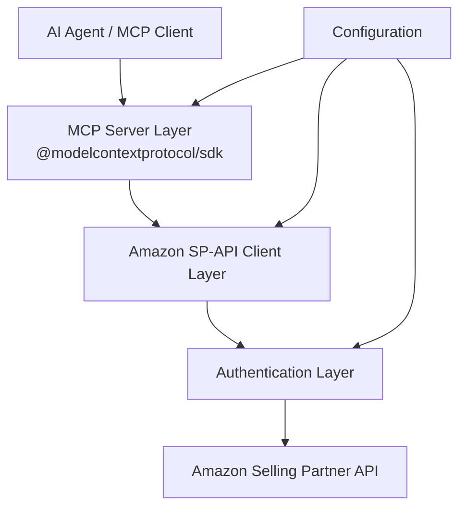

# Design Document: Amazon Seller MCP Client

## Overview

The Amazon Seller MCP Client is a TypeScript/JavaScript library that implements the Model Context Protocol (MCP) to provide AI agents with access to Amazon Selling Partner API functionality. This design document outlines the architecture, components, interfaces, and implementation details for creating a bridge between AI agents and Amazon's seller ecosystem.

The client will be built as a Node.js package that leverages the [@modelcontextprotocol/sdk](https://github.com/modelcontextprotocol/typescript-sdk) to create an MCP server, exposing Amazon Selling Partner API capabilities through standardized MCP resources and tools. This enables AI agents to perform seller operations such as managing listings, monitoring inventory, processing orders, and analyzing performance metrics.

## Architecture

The system follows a layered architecture with clear separation of concerns, built on top of the MCP TypeScript SDK:



### Key Components

1. **MCP Server Layer**: Uses the `@modelcontextprotocol/sdk` to implement the Model Context Protocol, handling client connections, registering resources and tools, and managing the communication protocol.

2. **Amazon SP-API Client Layer**: Provides a clean interface to the Amazon Selling Partner API, abstracting the complexity of API calls, request formatting, and response parsing.

3. **Authentication Layer**: Manages OAuth 2.0 authentication with Amazon, including token acquisition, storage, and refresh.

4. **Configuration**: Manages server settings, API credentials, and marketplace configurations.

## Components and Interfaces

### 1. MCP Server Component

This component implements the MCP protocol using the TypeScript SDK, exposing Amazon Selling Partner API functionality as MCP resources and tools. It follows the patterns established in the MCP TypeScript SDK.

```typescript
// Core MCP Server
import { McpServer, ResourceTemplate } from "@modelcontextprotocol/sdk/server/mcp.js";
import { StdioServerTransport } from "@modelcontextprotocol/sdk/server/stdio.js";
import { StreamableHTTPServerTransport } from "@modelcontextprotocol/sdk/server/streamableHttp.js";

interface AmazonSellerMcpConfig {
  name: string;
  version: string;
  credentials: AmazonCredentials;
  marketplaceId: string;
  region: AmazonRegion;
  debouncedNotifications?: boolean;
}

interface TransportConfig {
  type: 'stdio' | 'streamableHttp';
  httpOptions?: {
    port: number;
    host: string;
    enableDnsRebindingProtection?: boolean;
    allowedHosts?: string[];
    sessionManagement?: boolean;
  };
}

class AmazonSellerMcpServer {
  private server: McpServer;
  private spApiClient: AmazonSpApiClient;
  
  constructor(config: AmazonSellerMcpConfig);
  
  async connect(transportConfig: TransportConfig): Promise<void> {
    // Create appropriate transport based on config
    // Connect the MCP server to the transport
  }
  
  registerAllTools(): void {
    // Register all Amazon SP-API tools
  }
  
  registerAllResources(): void {
    // Register all Amazon SP-API resources
  }
  
  close(): Promise<void> {
    // Close the server and clean up resources
  }
}
```

### 2. Amazon SP-API Client Component

This component provides a clean interface to the Amazon Selling Partner API, handling request formatting, response parsing, and error handling.

```typescript
// Amazon SP-API Client
interface AmazonSpApiClientConfig {
  credentials: AmazonCredentials;
  region: AmazonRegion;
  marketplaceId: string;
  maxRetries?: number;
  timeoutMs?: number;
}

class AmazonSpApiClient {
  constructor(config: AmazonSpApiClientConfig);
  
  // Catalog API
  getCatalogItem(params: GetCatalogItemParams): Promise<CatalogItem>;
  searchCatalogItems(params: SearchCatalogItemsParams): Promise<CatalogItemSearchResult>;
  
  // Listings API
  getListings(params: GetListingsParams): Promise<Listing[]>;
  putListing(params: PutListingParams): Promise<ListingSubmissionResult>;
  deleteListing(params: DeleteListingParams): Promise<ListingSubmissionResult>;
  
  // Inventory API
  getInventory(params: GetInventoryParams): Promise<InventoryDetails>;
  updateInventory(params: UpdateInventoryParams): Promise<InventoryUpdateResult>;
  
  // Orders API
  getOrders(params: GetOrdersParams): Promise<Order[]>;
  getOrder(params: GetOrderParams): Promise<Order>;
  updateOrderStatus(params: UpdateOrderStatusParams): Promise<OrderUpdateResult>;
  
  // Reports API
  requestReport(params: RequestReportParams): Promise<ReportRequestResult>;
  getReport(params: GetReportParams): Promise<Report>;
  
  // Additional API methods for other SP-API endpoints...
}
```

### 3. Authentication Component

This component manages OAuth 2.0 authentication with Amazon, including token acquisition, storage, and refresh.

```typescript
// Authentication
interface AmazonCredentials {
  clientId: string;
  clientSecret: string;
  refreshToken: string;
  accessKeyId?: string;
  secretAccessKey?: string;
  roleArn?: string;
}

interface AuthTokens {
  accessToken: string;
  expiresAt: number;
}

class AmazonAuth {
  constructor(credentials: AmazonCredentials, region: AmazonRegion);
  getAccessToken(): Promise<string>;
  refreshAccessToken(): Promise<AuthTokens>;
  generateSecuredRequest(request: any): Promise<any>;
}
```

### 4. MCP Resources and Tools

The MCP server will expose Amazon Selling Partner API functionality through resources and tools following the patterns from the MCP TypeScript SDK:

#### Resources:

```typescript
import { McpServer, ResourceTemplate } from "@modelcontextprotocol/sdk/server/mcp.js";
import { z } from "zod";

// Example resource registrations
server.registerResource(
  "catalog-item",
  new ResourceTemplate("amazon-catalog://{asin}", { 
    list: undefined,
    complete: {
      asin: (value) => {
        // Provide ASIN completions based on search
        return searchCatalogItems(value).then(results => 
          results.map(item => item.asin)
        );
      }
    }
  }),
  {
    title: "Amazon Catalog Item",
    description: "Product details from Amazon's catalog"
  },
  async (uri, { asin }) => {
    const item = await spApiClient.getCatalogItem({ asin });
    return {
      contents: [{
        uri: uri.href,
        text: JSON.stringify(item, null, 2),
        mimeType: "application/json"
      }]
    };
  }
);

server.registerResource(
  "listings",
  new ResourceTemplate("amazon-listings://{sellerId}/{sku}", { 
    list: "amazon-listings://{sellerId}",
    complete: {
      sku: (value) => {
        // Provide SKU completions based on seller inventory
        return listSellerInventory().then(items => 
          items.map(item => item.sku).filter(sku => sku.startsWith(value))
        );
      }
    }
  }),
  {
    title: "Amazon Listings",
    description: "Seller product listings"
  },
  async (uri, { sellerId, sku }) => {
    if (sku) {
      const listing = await spApiClient.getListing({ sellerId, sku });
      return {
        contents: [{
          uri: uri.href,
          text: JSON.stringify(listing, null, 2),
          mimeType: "application/json"
        }]
      };
    } else {
      const listings = await spApiClient.getListings({ sellerId });
      return {
        contents: listings.map(listing => ({
          uri: `amazon-listings://${sellerId}/${listing.sku}`,
          text: JSON.stringify(listing, null, 2),
          mimeType: "application/json"
        }))
      };
    }
  }
);

server.registerResource(
  "inventory",
  new ResourceTemplate("amazon-inventory://{sellerId}/{sku}", { 
    list: "amazon-inventory://{sellerId}" 
  }),
  {
    title: "Amazon Inventory",
    description: "Seller inventory information"
  },
  async (uri, { sellerId, sku }) => {
    // Implementation similar to listings resource
  }
);

server.registerResource(
  "orders",
  new ResourceTemplate("amazon-order://{orderId}", { 
    list: "amazon-order://list" 
  }),
  {
    title: "Amazon Orders",
    description: "Seller orders information"
  },
  async (uri, { orderId }) => {
    // Implementation for retrieving order details
  }
);

server.registerResource(
  "reports",
  new ResourceTemplate("amazon-report://{reportId}", { 
    list: "amazon-report://list" 
  }),
  {
    title: "Amazon Reports",
    description: "Seller reports"
  },
  async (uri, { reportId }) => {
    // Implementation for retrieving report data
  }
);
```

#### Tools:

```typescript
import { McpServer } from "@modelcontextprotocol/sdk/server/mcp.js";
import { z } from "zod";

// Example tool registrations
server.registerTool(
  "create-listing",
  {
    title: "Create Product Listing",
    description: "Create a new product listing on Amazon",
    inputSchema: {
      sku: z.string().describe("Seller SKU for the product"),
      productType: z.string().describe("Amazon product type"),
      attributes: z.record(z.any()).describe("Product attributes")
    }
  },
  async ({ sku, productType, attributes }) => {
    try {
      const result = await spApiClient.putListing({
        sku,
        productType,
        attributes
      });
      
      return {
        content: [{ 
          type: "text", 
          text: `Successfully created listing for SKU: ${sku}. Submission ID: ${result.submissionId}` 
        }]
      };
    } catch (error) {
      return {
        content: [{ 
          type: "text", 
          text: `Error creating listing: ${error.message}` 
        }],
        isError: true
      };
    }
  }
);

server.registerTool(
  "update-inventory",
  {
    title: "Update Inventory",
    description: "Update inventory quantity for a product",
    inputSchema: {
      sku: z.string().describe("Seller SKU for the product"),
      quantity: z.number().describe("New inventory quantity"),
      fulfillmentChannel: z.enum(["AMAZON", "SELLER"]).describe("Fulfillment channel")
    }
  },
  async ({ sku, quantity, fulfillmentChannel }) => {
    try {
      const result = await spApiClient.updateInventory({
        sku,
        quantity,
        fulfillmentChannel
      });
      
      return {
        content: [{ 
          type: "text", 
          text: `Successfully updated inventory for SKU: ${sku}` 
        }]
      };
    } catch (error) {
      return {
        content: [{ 
          type: "text", 
          text: `Error updating inventory: ${error.message}` 
        }],
        isError: true
      };
    }
  }
);

server.registerTool(
  "process-order",
  {
    title: "Process Order",
    description: "Process an Amazon order (confirm, ship, etc.)",
    inputSchema: {
      orderId: z.string().describe("Amazon Order ID"),
      action: z.enum(["CONFIRM", "SHIP", "CANCEL"]).describe("Action to perform"),
      details: z.record(z.any()).optional().describe("Additional details for the action")
    }
  },
  async ({ orderId, action, details }) => {
    try {
      const result = await spApiClient.updateOrderStatus({
        orderId,
        action,
        details
      });
      
      return {
        content: [{ 
          type: "text", 
          text: `Successfully processed order ${orderId} with action: ${action}` 
        }]
      };
    } catch (error) {
      return {
        content: [{ 
          type: "text", 
          text: `Error processing order: ${error.message}` 
        }],
        isError: true
      };
    }
  }
);

// Example of a tool that uses LLM sampling for product description generation
server.registerTool(
  "generate-product-description",
  {
    title: "Generate Product Description",
    description: "Generate an optimized product description using AI",
    inputSchema: {
      productTitle: z.string().describe("Product title"),
      keyFeatures: z.array(z.string()).describe("Key product features"),
      targetAudience: z.string().optional().describe("Target audience for the product")
    }
  },
  async ({ productTitle, keyFeatures, targetAudience }) => {
    try {
      // Call the LLM through MCP sampling
      const response = await server.server.createMessage({
        messages: [
          {
            role: "user",
            content: {
              type: "text",
              text: `Please write an optimized Amazon product description for the following product:
              
Title: ${productTitle}
Key Features: ${keyFeatures.join(', ')}
${targetAudience ? `Target Audience: ${targetAudience}` : ''}

The description should be compelling, highlight the key features, and be optimized for Amazon SEO.`
            },
          },
        ],
        maxTokens: 500,
      });

      return {
        content: [
          {
            type: "text",
            text: response.content.type === "text" 
              ? `Generated Product Description:\n\n${response.content.text}` 
              : "Unable to generate product description"
          },
        ],
      };
    } catch (error) {
      return {
        content: [{ 
          type: "text", 
          text: `Error generating product description: ${error.message}` 
        }],
        isError: true
      };
    }
  }
);
```

## Data Models

### Core Data Models

```typescript
// Amazon API Models
interface AmazonRegion {
  endpoint: string;
  region: string;
}

interface CatalogItem {
  asin: string;
  attributes: Record<string, any>;
  identifiers: Record<string, any>;
  images?: Array<{
    link: string;
    height: number;
    width: number;
  }>;
  productTypes: Record<string, string>;
  relationships?: Record<string, any>;
  salesRanks?: Array<{
    title: string;
    link: string;
    rank: number;
  }>;
  summaries?: Array<{
    marketplaceId: string;
    brandName?: string;
    colorName?: string;
    itemName?: string;
    manufacturer?: string;
    modelNumber?: string;
  }>;
}

interface Listing {
  sku: string;
  status: string;
  identifiers: {
    marketplaceId: string;
    asin?: string;
    sellerId: string;
  };
  attributes: Record<string, any>;
  issues?: Array<{
    code: string;
    message: string;
    severity: string;
  }>;
  offers?: Array<{
    price: {
      amount: number;
      currencyCode: string;
    };
    quantity: number;
  }>;
}

interface InventoryDetails {
  sku: string;
  fulfillmentAvailability: Array<{
    fulfillmentChannelCode: string;
    quantity: number;
  }>;
}

interface Order {
  orderId: string;
  purchaseDate: string;
  orderStatus: string;
  fulfillmentChannel: string;
  salesChannel: string;
  orderTotal: {
    currencyCode: string;
    amount: number;
  };
  shipmentServiceLevelCategory: string;
  orderItems: Array<{
    asin: string;
    sellerSku: string;
    title: string;
    quantityOrdered: number;
    itemPrice: {
      currencyCode: string;
      amount: number;
    };
  }>;
  shippingAddress?: {
    name: string;
    addressLine1: string;
    addressLine2?: string;
    city: string;
    stateOrRegion: string;
    postalCode: string;
    countryCode: string;
  };
}

interface Report {
  reportId: string;
  reportType: string;
  processingStatus: string;
  createdTime: string;
  processingStartTime?: string;
  processingEndTime?: string;
  reportDocumentId?: string;
}
```

### MCP Response Models

```typescript
// MCP Response Models
interface ResourceResponse {
  contents: Array<{
    uri: string;
    text: string;
    mimeType?: string;
  }>;
}

interface ToolResponse {
  content: Array<{
    type: "text" | "resource_link";
    text?: string;
    uri?: string;
    name?: string;
    mimeType?: string;
    description?: string;
  }>;
  isError?: boolean;
}
```

## Error Handling

The client will implement a comprehensive error handling strategy:

1. **API Errors**: Errors from the Amazon Selling Partner API will be parsed and translated into meaningful MCP error responses.

2. **Rate Limiting**: The client will implement exponential backoff and retry mechanisms for rate-limited requests.

3. **Authentication Errors**: Token expiration and authentication failures will be handled with automatic token refresh when possible.

4. **Validation Errors**: Input validation will be performed before making API calls, with clear error messages for invalid inputs.

5. **Network Errors**: Timeouts and connection issues will be handled with appropriate retry logic.

Error responses will follow this structure:

```typescript
interface ErrorResponse {
  isError: true;
  content: [{
    type: "text";
    text: string; // Error message
  }];
  errorDetails?: {
    code: string;
    message: string;
    details?: any;
  };
}
```

## Testing Strategy

The testing strategy will include:

1. **Unit Tests**: Testing individual components in isolation with mocked dependencies.

2. **Integration Tests**: Testing the interaction between components.

3. **Mock Server Tests**: Using a mock Amazon SP-API server to test the client without making real API calls.

4. **End-to-End Tests**: Testing the complete flow with real API calls (using sandbox environments when available).

5. **Performance Tests**: Ensuring the client can handle expected load and properly implements rate limiting.

Test coverage will focus on:

- Authentication flows
- Resource and tool registration
- Request/response handling
- Error scenarios
- Edge cases (rate limiting, token expiration, etc.)

## Implementation Considerations

### Security

1. **Credential Management**: Credentials will never be exposed in logs or error messages.

2. **Token Storage**: Access tokens will be stored securely in memory only.

3. **Request Signing**: All requests to Amazon SP-API will be properly signed according to AWS Signature V4.

### Performance

1. **Connection Pooling**: HTTP connections will be reused when possible.

2. **Caching**: Responses that don't change frequently will be cached to reduce API calls.

3. **Batch Operations**: When supported by the API, operations will be batched to reduce the number of requests.

### Extensibility

1. **Modular Design**: Components will be designed for easy extension and customization.

2. **Plugin Architecture**: The client will support plugins for custom functionality.

3. **Event System**: An event system will allow for custom handlers for various operations.

### Deployment

The client will support multiple deployment options:

1. **Command-Line Tool**: Running as a standalone process with stdio transport.

2. **HTTP Server**: Running as an HTTP server with streamable HTTP transport.

3. **Embedded**: Running embedded within another Node.js application.

## Dependencies

The client will rely on the following key dependencies:

1. **@modelcontextprotocol/sdk**: For implementing the MCP protocol.

2. **amazon-sp-api**: For interacting with the Amazon Selling Partner API.

3. **zod**: For input validation and schema definition.

4. **axios**: For HTTP requests.

5. **winston**: For logging.

6. **node-cache**: For in-memory caching.

7. **dotenv**: For environment variable management.

8. **typescript**: For type safety and improved developer experience.